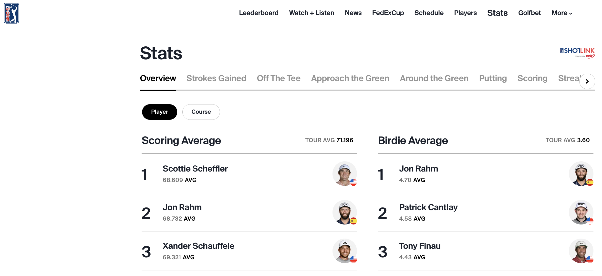
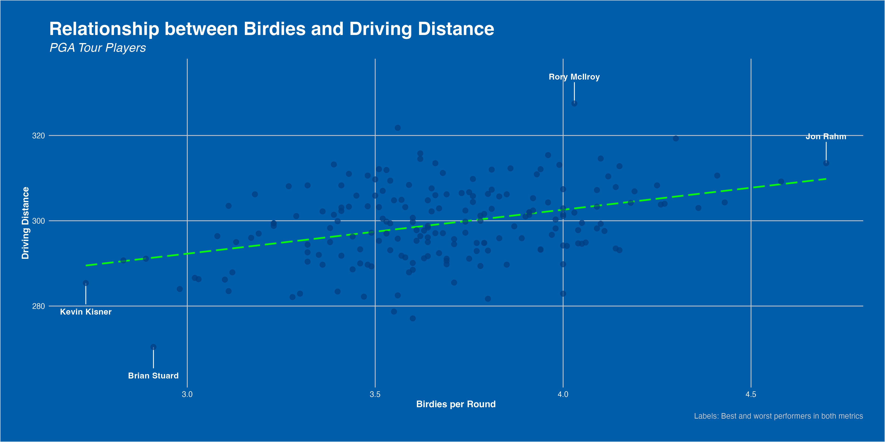

```{r setup, include=FALSE}

library(tidyverse)
library(DBI)
library(janitor)
library(ggforce)
library(grid)
library(png)

```

## PGA Tour Stats Database

Using data from the [**PGA Tour**](https://www.pgatour.com/stats) website, I have created a database of the 2022/23 season player statistics (update as of June 21st).

[](https://www.pgatour.com/stats)

### Database connection

```{r database connections}

pga_stats <- DBI::dbConnect(
  drv = RSQLite::SQLite(),
  dbname = here::here("data", "pga_stats.db")
)

DBI::dbListTables(pga_stats)

```

### Formatting & cleaning tables

Here, we create dataframes from the database connection, and use `janitor::clean_names()` to tidy the column names. Following, I've manually changed some of the column names - this will make it much clearer to readers later in my analysis.

```{r database formatting}

birdies <- data.frame(
  dplyr::tbl(pga_stats, "birdies_per_round")
  ) %>% 
  janitor::clean_names()

driving <- data.frame(
  dplyr::tbl(pga_stats, "driving_distance")
  ) %>% 
  janitor::clean_names()

gir <- data.frame(
  dplyr::tbl(pga_stats, "gir_pct")
  ) %>% 
  janitor::clean_names()

scoring <- data.frame(
  dplyr::tbl(pga_stats, "scoring_avg")
  ) %>% 
  janitor::clean_names()

scrambling <- data.frame(
  dplyr::tbl(pga_stats, "scrambling_pct")
  ) %>% 
  janitor::clean_names()

```

```{r cleaning tables}

birdies <- birdies %>% 
  select(-movement) %>% 
  rename(birdies_per_round = avg)

driving <- driving %>% 
  select(-movement) %>% 
  rename(driving_avg = avg)

gir <- gir %>% 
  select(-movement) %>% 
  rename(gir_pct = x)

scoring <- scoring %>% 
  select(-movement) %>% 
  rename(scoring_avg = avg)

scrambling <- scrambling %>% 
  select(-movement) %>% 
  rename(scrambling_pct = x)

```

## Data Visualisations

Before I commence with some exploratory data anaylsis, let's clearly define all of our variables of interest:

| Variable          | Description                                                                                   |
|----------------|--------------------------------------------------------|
| player            | Player's name                                                                                 |
| rank              | Player's PGA Tour rank in the variable of interest                                            |
| birdies_per_round | The average number of birdies a player makes in each PGA tour round (18 holes)                |
| driving_avg       | The average distance when driving off the tee (yds)                                           |
| gir_pct           | The percentage of greens each player reaches in regulation (GIR = Par -2 strokes)             |
| scoring_avg       | Each player's average 18-hole score (strokes)                                                 |
| scrambling_pct    | Percentage of holes that a player makes par-or-better, when failing to reach GIR (scrambling) |

### Driving Distance vs. Birdie Rate

Modern golf is epitomized by big hitters. But... do the big hitter's make birdies more frequently? Let's take a look...

```{r}

# Some references
source("pga_ggplot_theme.R")

# Left join the birdies and driving datasets
birdies_distance_plot <- birdies %>% 
  left_join(driving, by = "player") %>% 

  # Create the plot using ggplot
  ggplot(aes(x = birdies_per_round, y = driving_avg)) +

  # Add line segments and labels for Kevin Kisner and Brian Stuard
  geom_segment(data = . %>% filter(player %in% c("Kevin Kisner", "Brian Stuard")),
               aes(x = birdies_per_round, y = driving_avg, 
                   xend = birdies_per_round, yend = driving_avg - 5),
               color = "white") +
  geom_text(data = . %>% filter(player %in% c("Kevin Kisner", "Brian Stuard")),
            aes(label = player, x = birdies_per_round, y = driving_avg - 6), 
            vjust = 1, color = "white", fontface = "bold") +

  # Add line segments and labels for Rory McIlroy and Jon Rahm
  geom_segment(data = . %>% filter(player %in% c("Rory McIlroy", "Jon Rahm")),
               aes(x = birdies_per_round, y = driving_avg, 
                   xend = birdies_per_round, yend = driving_avg + 5),
               color = "white") +
  geom_text(data = . %>% filter(player %in% c("Rory McIlroy", "Jon Rahm")),
            aes(label = player, x = birdies_per_round, y = driving_avg + 7), 
            vjust = 1, color = "white", fontface = "bold") +
  
  # Adding a smoother line, using a linear regression
  geom_smooth(method = lm, color = "green", se = FALSE, linetype = "longdash") +
  
  # Add scatter points with customized aesthetics
  geom_point(size = 3, alpha = 0.7, color = "#003D81", shape = 21, fill = "#003D81") +

  # Set axis labels and plot titles with customized text appearance
  labs(x = "Birdies per Round", y = "Driving Distance",
       title = "Relationship between Birdies and Driving Distance",
       subtitle = "PGA Tour Players", caption = "Labels: Best and worst performers in both metrics") +
  theme(plot.title = element_text(color = "white", size = 20, face = "bold"),
        plot.subtitle = element_text(color = "white", size = 14),
        axis.title = element_text(color = "white", size = 12),
        axis.text = element_text(color = "white", size = 10),
        panel.background = element_rect(fill = "#032544"),
        panel.grid = element_blank()) +
  pga_theme

# Save the plot as a PNG image
ggsave("images/birdies_distance_plot.png", birdies_distance_plot, width = 16, height = 8)


view(birdies %>% 
  left_join(driving, by = "player") %>% 
  select(player, driving_avg, birdies_per_round))
```

Driving distance is a significant factor in golf, with longer hitters often having an advantage. On average, professional golfers drive the ball around 290-310 yards off the tee. However, it's important to note that accuracy and other aspects of the game also play a crucial role.

Birdies per round reflect a player's ability to convert scoring opportunities. On average, professional golfers make around 3-4 birdies per round. This statistic showcases their proficiency in capitalizing on favorable situations through accurate iron play and strong putting.

While driving distance can provide an edge, accuracy and course management are equally important. Players who prioritize precision over power can excel by strategically positioning themselves off the tee and utilizing their strong short game skills.

In summary, driving distance and birdies per round are vital metrics in golf. While longer hitters may have an advantage, accuracy and the ability to convert birdie opportunities are equally important. Finding the right balance between power, accuracy, and scoring ability is key to success on the golf course.


